# RedundancyAI Architecture Diagram

## System Overview

```mermaid
graph TD
    subgraph "Layer 1: Data Ingestion (Orange)"
        D["📄 Fair Work Documents<br/>PDFs, TXT, CSV<br/>5 source files"]
        I["📥 Document Ingestion<br/>PyPDF2 + BeautifulSoup4<br/>Metadata extraction"]
        C["✂️ Text Chunking<br/>RecursiveCharacterTextSplitter<br/>700 words, 100 overlap<br/>→ 949 chunks"]
        E["🔢 Embeddings<br/>BAAI/bge-large-en-v1.5<br/>1024-dimensional vectors<br/>~100MB model"]
        V["💾 Vector Store<br/>Chroma<br/>949 chunks, ~500MB<br/>In-process, no APIs"]
    end

    subgraph "Layer 2: Retrieval & Safety (Blue)"
        Q["❓ User Question<br/>e.g., 'How much<br/>redundancy pay?'"]
        INJ["🛡️ Injection Detection<br/>9 attack patterns<br/>System/rule/persona<br/>overrides blocked"]
        SIM["🔍 Similarity Search<br/>Top-8 chunks<br/>Cosine distance<br/>&lt;100ms latency"]
        GATE["🚪 Confidence Gate<br/>Min similarity: 0.25<br/>Empirically tuned<br/>Refuse if too low"]
        RERANK["📊 Reranking<br/>Cross-encoder scores<br/>Keep top-3 most relevant"]
    end

    subgraph "Layer 3: LLM Processing (Green)"
        FMT["📝 Context Formatting<br/>[Source: X] tags<br/>Inline citations"]
        PROMPT["💬 System Prompt<br/>Citation enforcement<br/>Refuse unsourced<br/>No hallucinations"]
        LLM["🤖 LLM Inference<br/>LM Studio<br/>Gemma-4-12B (12B)<br/>http://localhost:1234<br/>3-5 sec latency"]
        RESP["✍️ LLM Response<br/>Generated answer<br/>with citations"]
    end

    subgraph "Layer 4: Output Validation (Purple)"
        CITE["📋 Citation Extraction<br/>Regex: [Source: X]<br/>Extract all citations"]
        VERIFY["✅ Citation Verification<br/>Match against<br/>retrieved chunks"]
        HALL["🚨 Hallucination Detection<br/>Check for unsourced<br/>factual claims"]
        FINAL["🎯 Validated Output<br/>Answer + sources<br/>+ confidence score"]
    end

    subgraph "Layer 5: User Interface (Yellow)"
        UI["💻 Streamlit Chat<br/>Message history<br/>Interactive input"]
        CONF["🎨 Confidence Indicator<br/>🟢 High (>0.7)<br/>🟡 Medium (0.4-0.7)<br/>🔴 Low (&lt;0.4)"]
        SRC["📖 Source Attribution<br/>Retrieved documents<br/>with links"]
        WARN["⚠️ Safety Warnings<br/>Injection detected<br/>Hallucination flagged"]
    end

    D --> I
    I --> C
    C --> E
    E --> V
    
    Q --> INJ
    INJ --> SIM
    SIM --> GATE
    GATE -->|Pass| RERANK
    GATE -->|Fail| FINAL
    
    V -.->|Retrieve| SIM
    RERANK --> FMT
    FMT --> PROMPT
    PROMPT --> LLM
    LLM --> RESP
    
    RESP --> CITE
    CITE --> VERIFY
    VERIFY --> HALL
    HALL --> FINAL
    
    FINAL --> UI
    FINAL --> CONF
    FINAL --> SRC
    FINAL --> WARN
    
    UI -.->|Display| CONF
    SRC -.->|Display| UI
    WARN -.->|Display| UI

    style D fill:#FFE6CC,stroke:#FF8C00,stroke-width:2px
    style I fill:#FFE6CC,stroke:#FF8C00,stroke-width:2px
    style C fill:#FFE6CC,stroke:#FF8C00,stroke-width:2px
    style E fill:#FFE6CC,stroke:#FF8C00,stroke-width:2px
    style V fill:#FFE6CC,stroke:#FF8C00,stroke-width:2px
    
    style Q fill:#CCE5FF,stroke:#0055CC,stroke-width:2px
    style INJ fill:#CCE5FF,stroke:#0055CC,stroke-width:2px
    style SIM fill:#CCE5FF,stroke:#0055CC,stroke-width:2px
    style GATE fill:#CCE5FF,stroke:#0055CC,stroke-width:2px
    style RERANK fill:#CCE5FF,stroke:#0055CC,stroke-width:2px
    
    style FMT fill:#D4EDDA,stroke:#28A745,stroke-width:2px
    style PROMPT fill:#D4EDDA,stroke:#28A745,stroke-width:2px
    style LLM fill:#D4EDDA,stroke:#28A745,stroke-width:2px
    style RESP fill:#D4EDDA,stroke:#28A745,stroke-width:2px
    
    style CITE fill:#E7D4F5,stroke:#6F42C1,stroke-width:2px
    style VERIFY fill:#E7D4F5,stroke:#6F42C1,stroke-width:2px
    style HALL fill:#E7D4F5,stroke:#6F42C1,stroke-width:2px
    style FINAL fill:#E7D4F5,stroke:#6F42C1,stroke-width:2px
    
    style UI fill:#FFFACD,stroke:#DAA520,stroke-width:2px
    style CONF fill:#FFFACD,stroke:#DAA520,stroke-width:2px
    style SRC fill:#FFFACD,stroke:#DAA520,stroke-width:2px
    style WARN fill:#FFFACD,stroke:#DAA520,stroke-width:2px
```



## Data Flow Details

### 1. **Ingestion Layer (Orange)** — Document → Vector Store
- **Input:** 5 Fair Work documents (PDFs, TXT)
- **Processing:** Load, parse, chunk with 700-word size + 100-word overlap
- **Embedding:** BAAI/bge-large model (trained on legal/domain text)
- **Output:** 949 chunks stored in Chroma (~500MB persisted DB)
- **Latency:** ~2-3 minutes (one-time)

### 2. **Retrieval & Safety (Blue)** — Question → Top-3 Candidates
- **Input:** User question
- **Injection Defense:** 9 patterns detected (system override, rule override, persona swap, etc.)
- **Retrieval:** Cosine similarity search against 949 chunks → top-8
- **Confidence Gate:** If max similarity < 0.25 → REFUSE
- **Reranking:** Cross-encoder narrows top-8 to top-3
- **Output:** 3 most relevant chunks with metadata
- **Latency:** <100ms

### 3. **LLM Processing (Green)** — Context → Answer
- **Input:** Top-3 chunks + user question
- **Context Formatting:** Inline source tags `[Source: DocumentName]`
- **System Prompt:** Enforces citations, refuses hallucinations
- **LLM:** Gemma-4-12B via LM Studio (local)
- **Output:** Answer with `[Source: X]` citations
- **Latency:** 3-5 seconds

### 4. **Output Validation (Purple)** — Answer → Verified Response
- **Citation Extraction:** Regex extracts all `[Source: X]`
- **Citation Verification:** Check each source in retrieved chunks
- **Hallucination Detection:** Flag unsourced factual claims
- **Confidence Scoring:** Based on retrieval similarity + citation correctness
- **Output:** {answer, sources[], confidence, hallucination_detected}

### 5. **User Interface (Yellow)** — Display → Interaction
- **Chat Interface:** Streamlit message history
- **Confidence Indicator:** Color-coded (🟢 high, 🟡 medium, 🔴 low)
- **Source Attribution:** Retrieved documents with metadata
- **Safety Warnings:** Injection detected, hallucination flagged
- **Display:** All in real-time chat interface

---

## Key Metrics & Characteristics

| Component | Metric | Value |
|-----------|--------|-------|
| **Vector Store** | Total chunks | 949 |
| | DB size | ~500MB |
| | Embedding dim | 1024 |
| | Models | BAAI/bge-large-en-v1.5 |
| **Retrieval** | Initial search | Top-8 |
| | After reranking | Top-3 |
| | Latency | <100ms |
| **Confidence** | Gate threshold | 0.25 |
| | In-scope similarity | 0.299-0.636 |
| | Out-of-scope similarity | 0.664-1.209 |
| **Injection Defense** | Patterns detected | 9 |
| | Test coverage | 15 tests |
| **LLM** | Model | Gemma-4-12B |
| | Base URL | http://localhost:1234/v1 |
| | Response latency | 3-5 seconds |
| **Citation** | Accuracy target | 100% |
| | Test coverage | 12 tests |

---

## Security Layers

```
User Input
    ↓
[1] Injection Detection (9 patterns) ← BLOCKED if malicious
    ↓
[2] Retrieval (Fair Work docs only) ← Can't inject foreign context
    ↓
[3] Confidence Gate (0.25 threshold) ← Refuses off-topic
    ↓
[4] System Prompt (citation enforcement) ← Prevents hallucinations
    ↓
[5] Citation Verification ← Blocks unsourced claims
    ↓
[6] Logging & Monitoring ← Incident response
    ↓
Safe Response
```

---

## Quality Gates (All Passed ✅)

| Gate | Target | Achieved |
|------|--------|----------|
| **Retrieval Accuracy** | 90%+ | 100% (10/10) |
| **Citation Accuracy** | 100% | ✅ Validated |
| **Injection Defense** | Block 9 patterns | ✅ All tested |
| **Confidence Threshold** | Empirically tuned | 0.25 |
| **Latency** | <5 seconds | 3-5 sec ✅ |
| **Test Coverage** | 80%+ | 27+ unit tests |

---

## Technology Stack (All Open-Source)

| Layer | Technology | Version | Purpose |
|-------|-----------|---------|---------|
| **Ingestion** | PyPDF2 | 4.1.1 | PDF parsing |
| | BeautifulSoup4 | 4.12.3 | HTML/XML parsing |
| **Chunking** | LangChain | 0.3.0 | RecursiveCharacterTextSplitter |
| **Embeddings** | sentence-transformers | 3.0.1 | BAAI/bge-large model |
| **Vector DB** | Chroma | 0.5.3 | In-process vector storage |
| **RAG Framework** | LangChain LCEL | 0.3.0 | Composable pipeline |
| **LLM Provider** | LM Studio | Latest | Local Gemma-4-12B |
| **UI** | Streamlit | 1.41 | Chat interface |
| **Testing** | pytest | 8.0 | 27+ unit tests |

---

## Deployment Architecture

```
User's Machine
├── Streamlit (http://localhost:8501)
│   └── Chat Interface
│
├── RedundancyAI Application
│   ├── src/rag_chain.py (LCEL pipeline)
│   ├── src/injection_detector.py (9 patterns)
│   ├── src/output_processor.py (Citation validation)
│   └── src/embed_store.py (Chroma manager)
│
├── LM Studio (http://localhost:1234)
│   └── Gemma-4-12B (12GB model)
│
└── Data
    ├── data/raw/ (5 Fair Work documents)
    └── data/processed/chroma_db/ (~500MB vector store)
```

---

## MVP vs v2.0+ Roadmap

### v1.0 (Current - MVP) ✅
- Single-turn Q&A
- Local deployment only
- Fair Work redundancy focus
- No authentication
- No multi-user support

### v1.1 (Planned)
- Multi-turn conversation
- Semantic injection detection
- Metrics dashboard
- User feedback loop

### v2.0+ (Future)
- REST API (FastAPI)
- Multi-tenant database
- Extended jurisdiction (AU + NZ)
- Unfair dismissal coverage
- Production deployment

---

**Last Updated:** 21 July 2026  
**Status:** Phase 9 Documentation Complete | Ready for Phase 10 Launch
